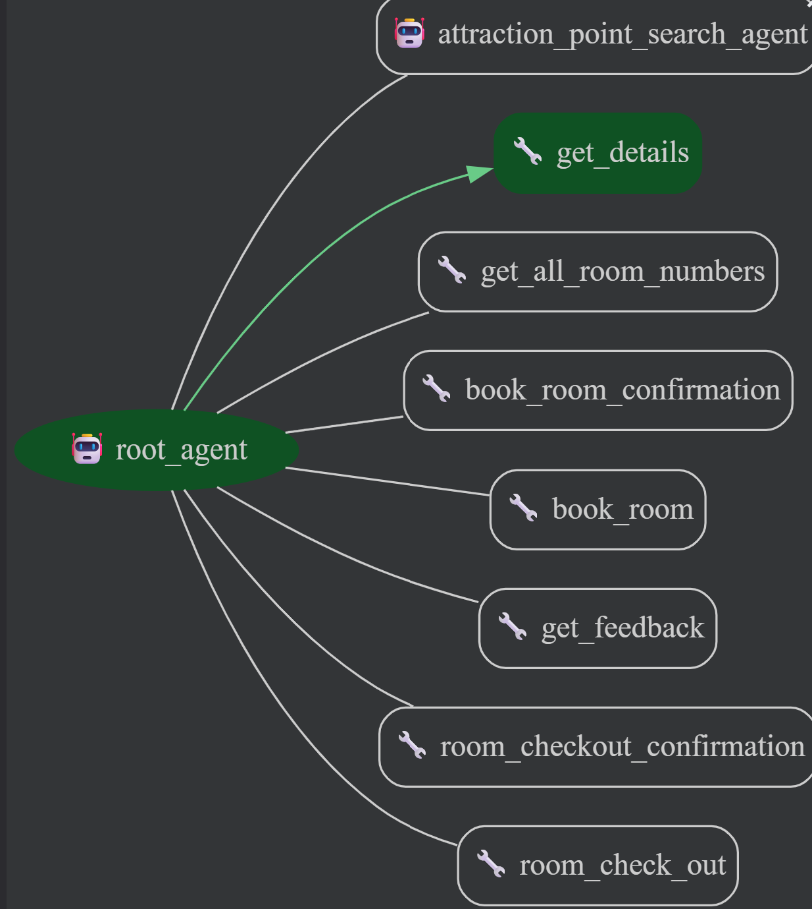

# Project Overview - Agent BHAVAN


This project contains the core logic for Agent BHAVAN, a multi-agent system designed to manage hotels. The agent is built using Google Agent Development Kit (ADK) and follows a modular architecture.



## Problem Statement

Many hotels struggle with service gaps and operational inefficiencies that directly harm guest satisfaction and revenue. Guest support is often limited to frontline staff hours, leaving late-night or early-morning travelers without timely help and increasing frustration. Peak periods create long queues and slow check-ins/check-outs when manual processing is the norm, while inconsistent staff knowledge produces uneven information and service quality. Language barriers further shrink a hotel’s ability to serve international guests reliably.


## Solution Statement

BHAVAN functions as a constantly accessible hospitality concierge that revolutionizes the way hotels engage with guests and oversee their operations. In contrast to systems limited by staff schedules or manual procedures BHAVAN offers round-the-clock assistance via natural chat communication, allowing guests to instantly reserve spa services, book dining tables, request late check-outs, or ask for additional towels without queuing or contacting the front desk. The agent provides precise and multilingual replies, eradicating human mistakes.


## Architecture


BHAVAN is a modular, multi-agent hospitality system built on Google’s Agent Development Kit (ADK). A single root agent orchestrates a set of specialized sub-agents and function-tools so the system behaves as a composable ecosystem of focused capabilities (guest interactions, approvals, bookings, maintenance routing, upselling, analytics) rather than a monolith. This modularity improves testability, extensibility, and clarity of responsibility.

**1. Latency reduction & availability :**

To speed availability checks and room selection, BHAVAN uses a precomputed room map (JSON). Faster available room search, sink with database if any corruption occure.

**2. Limitations :**

- Local demo datastore only: Not connected to any real property management system; intended for development and testing.
- Mocked payments: Approvals and charges are simulated for demo purposes; do not represent real financial flows. 


## Essential Tools & Utilities

BHAVAN offers a targeted collection of utilities and agent-specific tools designed for room administration, confirmation handling and suggestions directed at guests. Every element fulfills a role, within the hospitality process.

**1) Room Map utilities**

A consolidated set of tools tasked with verifying room numbers setting up or refreshing the room map fetching available rooms and modifying room occupancy during check-in and check-out procedures. These features together uphold the hotel’s binary room availability map. Guarantee quick consistent room searches and alignment, with the demo datastore.

**2) booking**

Function-call utilities that modify room statuses in the datastore. These symbolize the operations supporting each booking and checkout processed by the system.

**3) confirmation**

Approval utilities that enforce a confirmation step before sensitive operations like booking or checkout are executed. These tools ensure explicit guest consent before finalizing any room-related action.


## Technologies used 
- Custom Tools
- Multi-Agent System
- Context engineering

## Capabilities
- Prebooking
- Cancelling Prebooking
- Prebooking To Check-In
- On Time Booking (Check-In)
- Check-Out

## File Structure
```
BHAVAN/
  ├── Agent/                             # Root agent and all ADK tool definitions
  │   ├── function_tools/                      # All function Tools
  │   │   ├── __init__.py
  │   │   ├── about.py                          # Function that returns hotel details
  │   │   ├── check_room.py                     # Function for room details checking
  │   │   ├── get_feedback.py                   # Function for storing feedback
  │   │   └── pay.py                            # Payment tool
  │   ├── sub_agents/                           # All subagents
  │   │   ├── sub_agent_tools/                  # Tools for sub agents                  
  │   │   │   ├── __init__.py
  │   │   │   ├── cancel_prebooking_tool.py     # Required functions to cancel prebooking
  │   │   │   ├── comfort_requests.py           # Required functions for comfort requests
  │   │   │   ├── prebooking_to_checkin.py      # Required functions check in from prebooking
  │   │   │   ├── prebooking_tool.py            # Required functions to prebook rooms
  │   │   │   ├── room_check_in.py              # Required functions for checking-in room
  │   │   │   └── room_check_out.py             # Required functions for checking-out from a room
  │   │   ├── __init__.py                       
  │   │   ├── booking_agent.py                  # Agent for booking room
  │   │   ├── general_agent.py                  # Agent for general comfort request
  │   │   ├── prebooking_agent.py               # Agent for prebooking room
  │   │   └── tourist_place_agent.py            # Agent for searching tourist spots (Not Implemented Now)
  │   ├── utils.py                              # All util functions
  │   │   ├── __init__.py
  │   │   ├── json_utils.py                     # Load / update / save room map (JSON)
  │   │   ├── room_map_utils.py                 # Room related functions
  │   │   └── utils.py                          # Util Configuration
  │   ├── __init____.py          
  │   ├── .env                                  # GOOGLE_API_KEY 
  │   ├── agent.py                              # Root Agent (BHAVAN)
  │   ├── config.py                             # Required configurations
  │   ├── database.py                           # Database connections
  │   ├── hotel_details.py                      # Hotel details
  │   ├── instruction.py                        # Instruction for Agents
  │   ├── logging.py                            # Logging file configuration (Not Implemented Yet)
  │   └── model.py                              # Database schema models
  ├── artifact/                                 # Artifact folder
  │   └── room_map.json                         # Room map
  ├── .gitignore                                # Gitignore 
  ├── hotel_management_db.db                    # Database that stores all datas
  ├── LICENSE                                   # License file 
  ├── README.md                                 # Readme file
  └── requirments.txt                           # Required libraries / modules
```


## How To Run BHAVAN
1. Clone the repository
``` 
git clone https://github.com/ItsRikan/BHAVAN.git
cd BHAVAN
 ```
2. Create Virtual Environment
```
python3 -m venv venv          # For Linux/macOS
python -m venv venv           # For Windows
```
3. Activate the Virtual Environment
```
source venv/bin/activate      # For Linux/macOS
venv/Scripts/activate         # For Windows
```
4.  Install dependencies
```
pip install -r requirements.txt
```
5. Create .env file inside Agent and write
```
GOOGLE_API_KEY = [your_google_api_key]
```
6. Go to BHAVAN directory and run the agent
```
adk web
```
7. Chose Agent from side bar dropdown